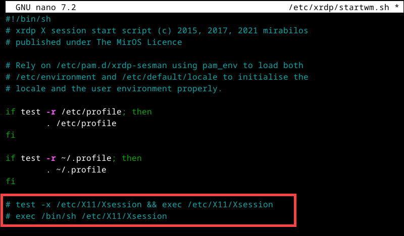
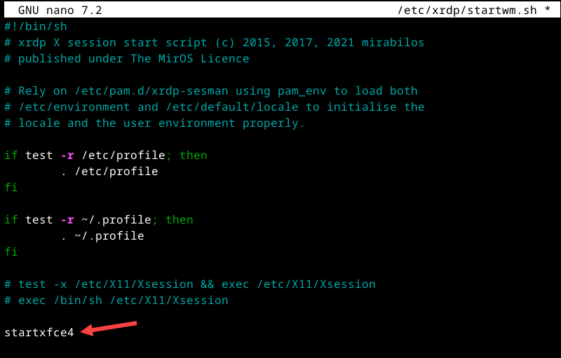
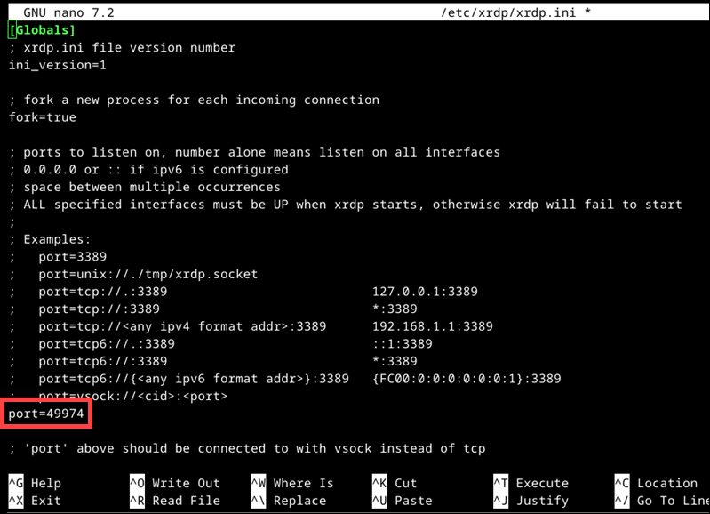
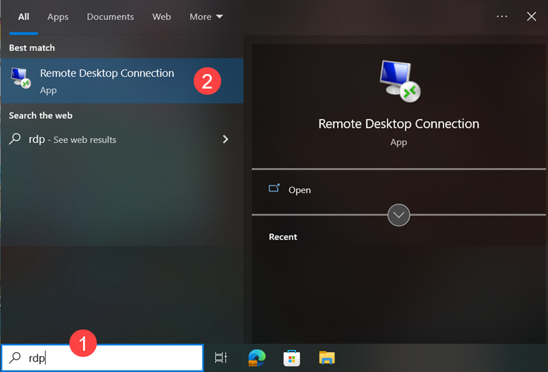
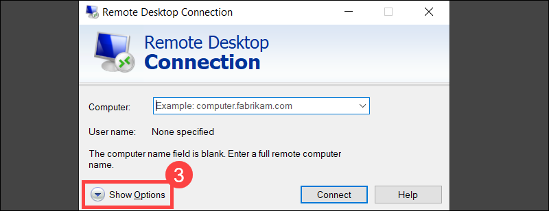
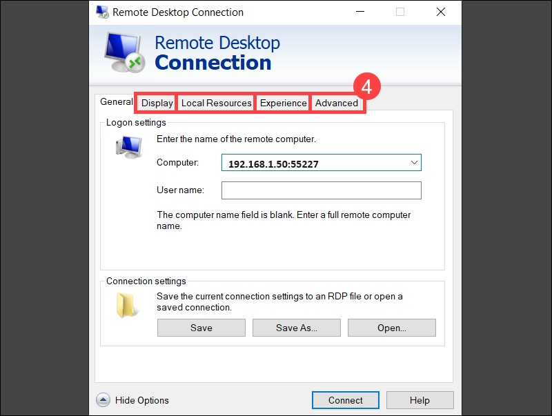

## Debian 12 Access Remote

[Debian Access Remote](https://phoenixnap.com/kb/debian-remote-desktop)

## Cmds Access Remote Linux
```bash
1) sudo apt update && sudo apt upgrade

2) sudo apt install xfce4 xfce4-goodies -y

3) sudo reboot

4) sudo apt install xrdp -y

# Check Status
5) sudo systemctl status xrdp


# Configure xrdp to use XFCE
6) sudo nano /etc/xrdp/startwm.sh

# Locate the following lines and add a # (hashtag) at the beginning of each line:
- FROM
test -x /etc/X11/Xsession && exec /etc/X11/Xsession
exec /bin/sh /etc/X11/Xsession
- TO
# test -x /etc/X11/Xsession && exec /etc/X11/Xsession
# exec /bin/sh /etc/X11/Xsession
```


```bash
# Append the following line to the end of the file
7) startxfce4
```

```bash
8) sudo systemctl restart xrdp

# Configure xrdp Port (Optional)
9) sudo nano /etc/xrdp/xrdp.ini


# Locate the port parameter in the [Globals] section and set the desired value. 
# In this example, the RDP port is  49974:
10) port=49974
```


```bash
11) sudo systemctl restart xrdp
```
# Open a Port for Incoming Traffic in Firewalld
```bash
12) sudo apt install firewalld -y

13) sudo systemctl start firewalld

14) sudo systemctl enable firewalld

15) sudo firewall-cmd --add-port=49974/tcp --permanent

# Reload Firewall
16) sudo firewall-cmd --reload
```

# Setup RDP Windows




