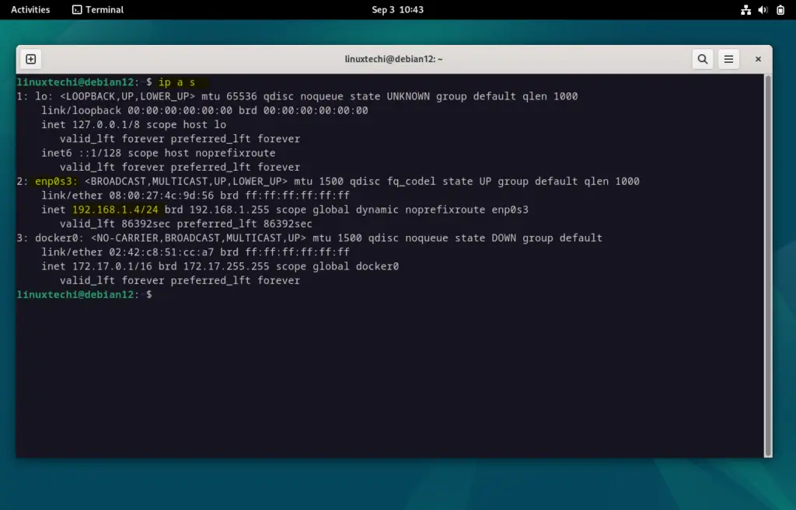
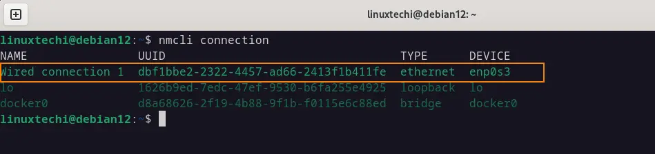

# Static IP Address Debiam
[How to Assign Static IP Address on Debian 12](https://www.linuxtechi.com/configure-static-ip-address-debian/)

## Cmd Line
```bash
  ip add show
```


* Next, run nmcli command to get connection name
```bash
$ nmcli connection
```


* Once we get the connection name, run below nmcli command to assign static ipv4 address
> $ nmcli con mod  ‘connection-name’ ipv4.address  <IP-Address>
```bash
$ sudo nmcli connection modify 'Wired connection 1' ipv4.address 192.168.1.50/24
```
* Set the gateway by running below
```bash
$ sudo nmcli connection modify 'Wired connection 1' ipv4.gateway 192.168.1.1 
``` 