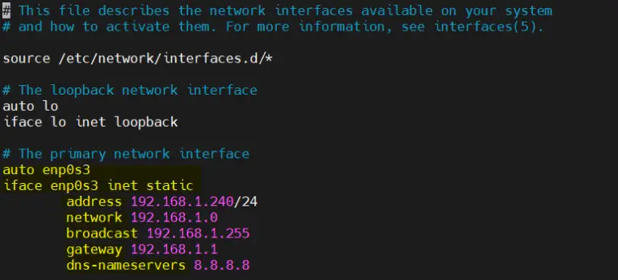
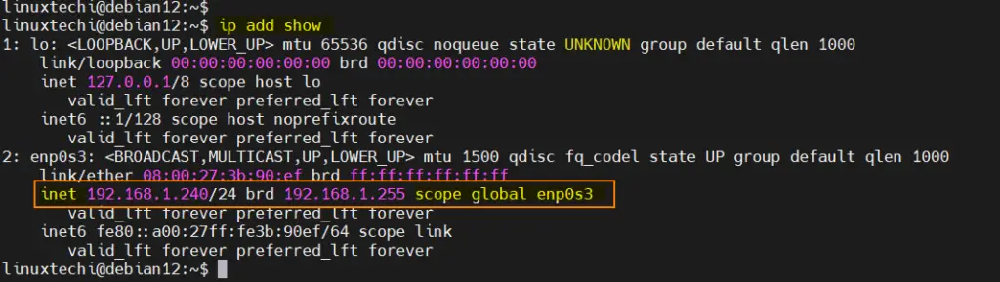

# Static IP Address Debiam
[How to Assign Static IP Address on Debian 12](https://www.linuxtechi.com/configure-static-ip-address-debian/)

## Cmd Line
```bash
  ip add show
```


* Next, run nmcli command to get connection name
```bash

$  apt intall network-manager 


$ nmcli connection
```


* Once we get the connection name, run below nmcli command to assign static ipv4 address
> $ nmcli con mod  ‘connection-name’ ipv4.address  <IP-Address>
```bash
$ sudo nmcli connection modify 'Wired connection 1' ipv4.address 192.168.1.50/24


$ nmcli connection modify 'lo' ipv4.address 192.168.1.55/24

```
* Set the gateway by running below
```bash
$ sudo nmcli connection modify 'Wired connection 1' ipv4.gateway 192.168.1.1 
``` 

Change Configuration from DHCP to Manual , so that IP will be static and persistent, run
```bash
$  sudo nmcli connection modify 'Wired connection 1' ipv4.method manual
```
Set the DNS server IP by running below command,
```bash
sudo nmcli connection modify 'Wired connection 1' ipv4.dns '8.8.8.8'
```
Disable and enable the connection so that above changes come into the effect.
```bash
# DNS1
$ sudo nmcli connection down 'Wired connection 1'

$ sudo nmcli connection up 'Wired connection 1'

$ sudo nmcli connection down 'enp0s3'

$ sudo nmcli connection up 'enp0s3'


# DNS2
$ sudo nmcli connection down 'lo'
ping 
$ sudo nmcli connection up 'lo'

```

Output of above commands would look like below:
```bash
 ip add show enp0s3
```

Assign Static IP Address on Minimal Installed Debian 12
```bash
$ cat /etc/network/interfaces
```

Edit the file and set the static IP address as shown below,
```bash
$ sudo nano /etc/network/interfaces
```
Replace the line ‘allow-htplug enp0s3’ with ‘auto enp0s3‘ and change dhcp parameter to static.  Below is my sample file, change interface name and ip details as per your environment.
```bash
auto enp0s3
iface enp0s3 inet static
        address 192.168.1.240/24
        network 192.168.1.0
        broadcast 192.168.1.255
        gateway 192.168.1.1
        dns-nameservers 8.8.8.8
```

To make above changes into the effect the restart the network service
```bash
$ sudo systemctl restart networking.service
```
Now, run ip command to verify the ip address,
```bash
$ ip add show
```

