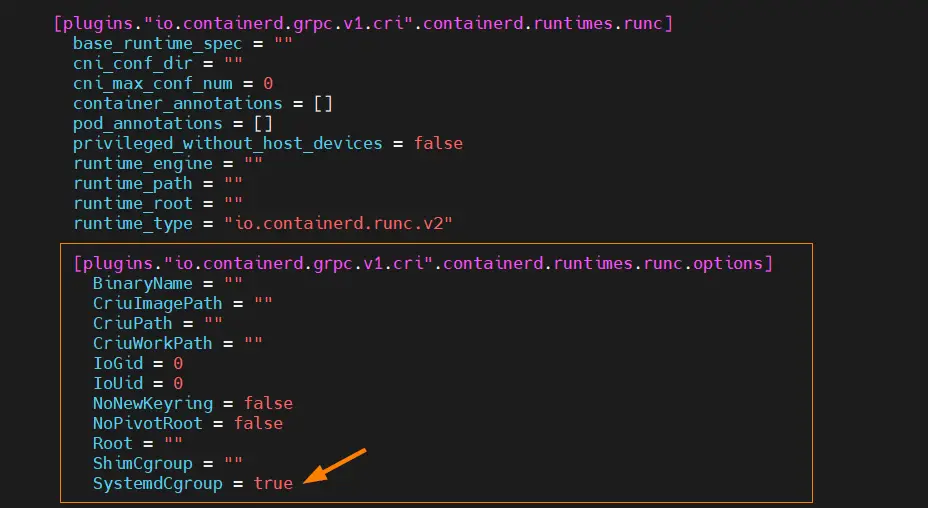
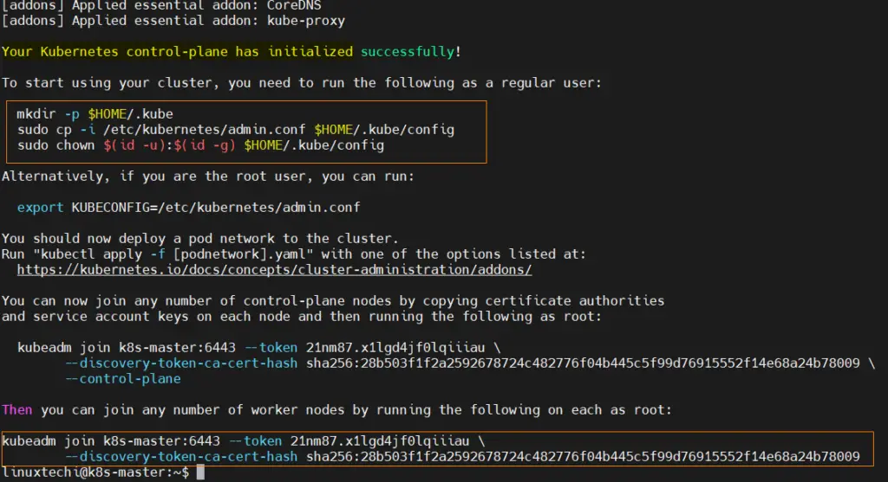
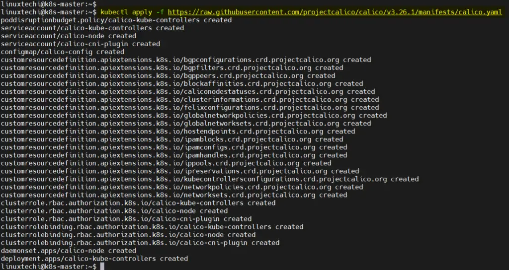
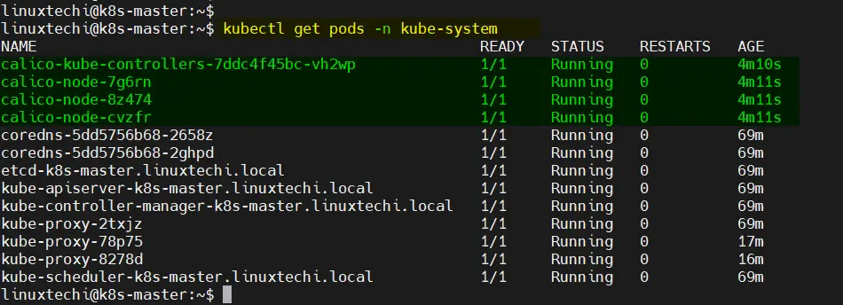
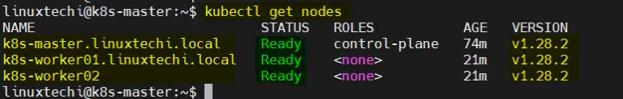

# KUBERNETES INSTALL DEBIAN 12 

# CRETE VIRTUAL MACHINES

1) Set Host Name and Update Hosts File
Login to each node (master & woker nodes) and set their hostname using hostnamectl command.

```bash
  Master Node (k8s-master) – 192.168.1.23
  Worker Node 1 (k8s-worker01) – 192.168.1.24
  Worker Node 2 (k8s-worker02) – 192.168.1.25
```
Also add the following entries in /etc/hosts file on all the nodes,

```bash
192.168.1.23   k8s-master.linuxtechi.local     k8s-master
192.168.1.24   k8s-worker01.linuxtechi.local   k8s-worker01
192.168.1.25   k8s-worker02.linuxtechi.local   k8s-worker02
```
2) Disable Swap on All Nodes
For kubelet to work smoothly, it is recommended to disable swap. Run following commands on master and worker nodes to turn off swap.
```bash
$ sudo swapoff -a

$ sudo sed -i '/ swap / s/^\(.*\)$/#\1/g' /etc/fstab
```
3) Add Firewall Rules for Kubernetes Cluster
On Master node, run
```bash
 sudo ufw allow 6443/tcp
 sudo ufw allow 2379/tcp
 sudo ufw allow 2380/tcp
 sudo ufw allow 10250/tcp
 sudo ufw allow 10251/tcp
 sudo ufw allow 10252/tcp
 sudo ufw allow 10255/tcp
 
```
On Worker Nodes,
```bash
 sudo ufw allow 10250/tcp
 sudo ufw allow 30000:32767/tcp
 sudo ufw reload
```
Note: If firewall is disabled on your Debian 12/11 systems, then you can skip this step.

4) Install Containerd Run time on All Nodes  or Docker Containers
<span style="color: yellow;">
VERIFY WHICH ONE IS GOING TO BE BETTER [DOCKER CONTAINER](https://www.knowledgehut.com/blog/devops/docker-vs-containerd) OR [CONTAINERD](https://www.knowledgehut.com/blog/devops/docker-vs-containerd)
</span> 

Containerd is the industry standard container run time and supported by Kubernetes. So, install containerd on all master and worker nodes.

Before installing containerd, set the following kernel parameters on all the nodes.

```bash

$ cat <<EOF | sudo tee /etc/modules-load.d/containerd.conf 
overlay 
br_netfilter
EOF

$ sudo modprobe overlay 

$ sudo modprobe br_netfilter

$ cat <<EOF | sudo tee /etc/sysctl.d/99-kubernetes-k8s.conf
net.bridge.bridge-nf-call-iptables = 1
net.ipv4.ip_forward = 1 
net.bridge.bridge-nf-call-ip6tables = 1 
EOF
```
To make above changes into the effect, run
```bash
$ sudo sysctl --system
```

Now, install conatinerd by running following apt command on all the nodes.
```bash
$ sudo apt update

$ sudo apt -y install containerd
```

Next, configure containerd so that it works with Kubernetes, run beneath command on all the nodes
```bash
$ containerd config default | sudo tee /etc/containerd/config.toml >/dev/null 2>&1
```

## Set cgroupdriver to systemd on all the nodes,
Edit the file ‘/etc/containerd/config.toml’ and look for the section 

‘[plugins.”io.containerd.grpc.v1.cri”.containerd.runtimes.runc.options]’ and change ‘SystemdCgroup = false’ to ‘SystemdCgroup = true‘

```bash
$ sudo nano /etc/containerd/config.toml

 # Alter SystemdCgroup = true

 SystemdCgroup = true
```


Restart and enable containerd service on all the nodes,
```bash

$ sudo systemctl restart containerd

$ sudo systemctl enable containerd

```


5) Add Kubernetes Apt Repository
In Debian 12/11, Kubernetes related packages are not available in the default package repositories. We have to add additional Kubernetes apt repository on all the nodes, run
```bash
$ sudo systemctl enable containerd

$ curl -s https://packages.cloud.google.com/apt/doc/apt-key.gpg | sudo gpg --dearmour -o /etc/apt/trusted.gpg.d/cgoogle.gpg

$ sudo apt-add-repository "deb http://apt.kubernetes.io/ kubernetes-xenial main"
```
6) Install Kubernetes Tools
Next, install the Kubernetes tools, including kubeadm, kubelet, and kubectl on all the nodes.
```bash
$ sudo apt update

$ sudo apt install kubelet kubeadm kubectl -y

$ sudo apt-mark hold kubelet kubeadm kubectl
```
7) Install Kubernetes Cluster with Kubeadm
Now, we are all set to initialize Kubernetes cluster, run following command only from master node,

<span style="color: #ff474c;">IT SHOULD CONNECT REMOTELY TO YOUR Virtual Machine MASTER-NODE os k8s-master</span>

# Do not run if you ment to Use JOIN
<span style="color: #ff474c;">kubeadm init (do not do this)</span>
# on a worker node before joining. 

* This is only run on your primary node. 
<span style="color: yellow;">kubeadm init (ONLY PRIMARY NODE)</span>

* Doing this can be why you already have these files, when you should not. 
## Clean UP Reset Kubernetes files
```bash
  kubeadm reset
```

#  [ERROR CRI]: container runtime is not running: 
```bash
  sudo rm /etc/containerd/config.toml
  sudo systemctl restart containerd
  sudo kubeadm init
```

# Alternative
```bash
$ sudo kubeadm reset
$ sudo swapoff -a 
```
##  kubeadm init 
```bash

$ sudo kubeadm init --control-plane-endpoint=admin-node

$ sudo kubeadm init --pod-network-cidr=192.168.1.55/24 --kubernetes-version "1.28.2"
or

$ sudo kubeadm init --control-plane-endpoint=master-node
```
## $HOME/.kube
```bash
$ sudo rm -rf $HOME/.kube

$ mkdir -p $HOME/.kube
$ sudo cp -i /etc/kubernetes/admin.conf $HOME/.kube/config
$ sudo chown $(id -u):$(id -g) $HOME/.kube/config

$ sudo systemctl enable docker.service
$ sudo service kubelet restart

$ kubectl get nodes
Notes:

If the port refuses to be connected, please add the following command.
$ export KUBECONFIG=$HOME/admin.conf

```

# IMPORTANTE <span style="color: yellow;">kubeadm init (ONLY PRIMARY NODE)</span> IN CASE YOU WANT TO USE <span style="color: yellow;">JOIN</span> FOR WORKERS NODES
```bash
# IMPORTANT  ADMIN-NODE  OR PRIMARY NODE 
$ sudo kubeadm init --control-plane-endpoint=admin-node 

# IMPORTANT  KAFKA-NODE  OR WORKER01-NODE IF YOU ARE NOT USING JOIN
$ sudo kubeadm init --control-plane-endpoint=kafka-node # (KAFKA STREAM)
```


Above output confirms that control plane has been initialized successfully. In the output, we have commands for regular user for interacting with the cluster and also the command to join any worker node to this cluster.

To start interacting with cluster, run following commands on master node

```bash
$ mkdir -p $HOME/.kube

$ sudo cp -i /etc/kubernetes/admin.conf $HOME/.kube/config

$ sudo chown $(id -u):$(id -g) $HOME/.kube/config


systemctl restart kubelet
```
Run following kubectl command to get nodes and cluster information,

```bash
$ kubectl get nodes

$ kubectl cluster-info
```
# JOIN kubectl
* On your worker nodes, join them to the cluster by running the command that was displayed when you initialized the master node. It will look something like this ‘Kubeadm join’

* Note: Copy the exact command from the output of ‘kubeadm init’ command. In my case, following is the command

# <span style="color: yellow;">Create a Token Join</span>
```bash
kubeadm token create --print-join-command

# Expected
kubeadm join admin-node:6443 --token ghhiar.8a20wq9i5p9u2qai --discovery-token-ca-cert-hash sha256:6eafd2ee10c75a0f758fbf39993488cb0d67f27f36d808471305946a257b617b

# Remove a Node from Cluster
kubectl drain node <node-name>

kubectl drain <node-name> --ignore-daemonsets

kubectl delete node <node-name>

```


```bash
Alternatively, if you are the root user, you can run:

  export KUBECONFIG=/etc/kubernetes/admin.conf

You should now deploy a pod network to the cluster.
Run "kubectl apply -f [podnetwork].yaml" with one of the options listed at:
  https://kubernetes.io/docs/concepts/cluster-administration/addons/

You can now join any number of control-plane nodes by copying certificate authorities
and service account keys on each node and then running the following as root:

  kubeadm join admin-node:6443 --token punhtw.0z9lp6a83d5otkrq \
        --discovery-token-ca-cert-hash sha256:d21168649713bc26b61cddd2358e52f10d3d5bddd9d696b2f2e8ba9eeb7d9f9f \
        --control-plane

Then you can join any number of worker nodes by running the following on each as root:

# TOKEN CREATE

kubeadm token create --print-join-command

# admin-node
sudo kubeadm join admin-node:6443 --token w5hcpq.7lne1j366ih0sf98 --discovery-token-ca-cert-hash sha256:60b5d246a904db0eca0918efd522adbaece1de66c6f4e0bc204edc729981a34a


# master-node
kubeadm join master-node:6443 --token d6mofk.fkybpq3raqeq4yty --discovery-token-ca-cert-hash sha256:1376eb0d83b2ba39f666ca1b0a5e26a10d60ab2219eb2b61b2662e2ea025e097


```
8) Setup Pod Network Using Calico
On the master node, run beneath command to install calico,
```bash
$  kubectl apply -f https://raw.githubusercontent.com/projectcalico/calico/v3.26.1/manifests/calico.yaml
```

Allow Calico ports in OS firewall, run beneath ufw commands on all the nodes,
```bash
 sudo ufw allow 179/tcp
 sudo ufw allow 4789/udp
 sudo ufw allow 51820/udp
 sudo ufw allow 51821/udp
 sudo ufw reload
```
Verify the status of Calico pods, run
```bash
 kubectl get pods -n kube-system
```


# Perfect, now check nodes status again,



## Deploying pods to specific worker nodes in a multi-node cluster

* Apply labels
```bash

# Type: <key> <vallue> 
kubectl get nodes --show-labels

kubectl label node master-node stream=kafka

# Usage:
...
spec
  nodeSelector:
    stream: "kafka"

...
spec
  nodeSelector:
    kubernetes.io/hostname: "master-node"
...  


# Remove
kubectl label node master-node stream-kafka-

kubectl label nodes worker-1.ibm.com node-apim=apim

# Add
kubectl label nodes master-node.intranet.com node-kafka=stream-app

kubectl label nodes master-node node-kafka=stream-app

# Remove
kubectl label nodes master-node.intranet.com node-kafka-

kubectl label nodes master-node node-kafka-

kubectl label nodes worker-1.ibm.com node-apim=apim
```


9) Test Kubernetes Cluster Installation
In order validate and test Kubernetes cluster installation, let’s try to deploy nginx based application via deployment. Run beneath commands,
```bash
$ kubectl get nodes --show-labels

$ kubectl create deployment nginx-app --image=nginx --replicas 2 

$ kubectl expose deployment nginx-app --name=nginx-web-svc --type NodePort --port 80 --target-port 80

$ kubectl describe svc nginx-web-svc

```

Try to access the nginx based application using following curl command along with the nodeport 32283.

Note : In the curl command we can use either of worker node’s hostname.
```bash
 curl http://admin-node:31880
```

# THROUBLESHOOTING  certificate  x509 
[Certificate  x509](https://medium.com/@guilospanck/kubernetes-x509-certificate-has-expired-or-is-not-yet-valid-error-cb9ca581d38b)
* Error Certificate  x509
```bash

sudo kubeadm certs check-expiration

sudo kubeadm certs renew all
```


# THROUBLESHOOTING TAINTS & TOLERANTS
```bash

# Admin-Node Describe nodes
sudo kubectl describe nodes admin-node

# Admin-Node Remove taints
sudo kubectl taint nodes admin-node node-role.kubernetes.io/control-plane:NoSchedule-


# Master-Node Describe nodes
sudo  kubectl describe nodes master-node

# Master-Node Remove taints
sudo kubectl taint nodes master-node node-role.kubernetes.io/control-plane:NoSchedule-

```


(Taints Good Sample)[https://www.densify.com/kubernetes-autoscaling/kubernetes-taints/]

* From the output above, we noticed that the master nodes are already tainted by the Kubernetes installation so that no user pods land on them until intentionally configured by the user to be placed on master nodes by adding tolerations for those taints. 
* The output also shows a worker node that has no taints. We will now taint the worker so that only front-end pods can land on it. We can do this by using the kubectl taint command.

## Creating a Taint for app Kafka apps for master-node
```bash
# Create Taint
kubectl taint nodes master-node app=kafka:NoSchedule
  node/master-node tainted
```
## Apply on Yaml File
```bash
  ...
      tolerations:
        - effect: NoSchedule
          key: app
          operator: Equal
          value: kafka
  ...
```


## Creating a Taint for app frontend for worke-02
```bash
kubectl taint nodes cluster01-worker-1 app=frontend:NoSchedule
  node/cluster01-worker-1 tainted

kubectl taint nodes master-node app2=frontend:NoSchedule
  node/cluster01-worker-1 tainted

kubectl create ns frontend

kubectl run nginx --image=nginx --namespace frontend

kubectl get events --all-namespaces  | grep -i $podname

kubectl get events --all-namespaces  | grep -i kafka-subscriber

kubectl get event --namespace python-pods --field-selector involvedObject.name=kafka-subscriber

kubectl get node --selector='!node-role.kubernetes.io/control-plane'

kubectl get pods --field-selector="spec.nodeName=master-node" -n python-pods

kubectl get volumeattachment --field-selector="spec.nodeName=mynode"

kubectl get pods -n frontend

kubectl get events -n frontend

kubectl get deploy nginx -o yaml > nginx.yaml

# Syntax for downloading yaml's from kubernetes
kubectl get [resource type] -n [namespace] [resource Name] -o yaml > [New file name]

kubectl get [resource type] -n [namespace] [resource Name] -o yaml > [New file name]


kubectl get deploy --all-namespaces -o yaml --export

kubectl api-resources
```

* Cmds to read tains

```bash
kubectl get nodes -o=custom-columns=NodeName:.metadata.name,TaintKey:.spec.taints[*].key,TaintValue:.spec.taints[*].value,TaintEffect:.spec.taints[*].effect

#Check Node Taints
kubectl get nodes --show-labels

kubectl describe nodes master-node

kubectl get nodes -o=custom-columns=NodeName:.metadata.name,TaintKey:.spec.taints[*].key,TaintValue:.spec.taints[*].value,TaintEffect:.spec.taints[*].effect

  
  kubectl get nodes -o custom-columns=NAME:.metadata.name,TAINTS:.spec.taints --no-headers 
  # Expected:
  admin-node   [map[effect:NoSchedule key:node-role.kubernetes.io/control-plane]]

  kubectl describe node node_name | grep 'Taints'
  Taints:             node-role.kubernetes.io/control-plane:NoSchedule

  kubectl get nodes -o go-template='{{printf "%-50s %-12s\n" "Node" "Taint"}}{{- range .items}}{{- if $taint := (index .spec "taints") }}{{- .metadata.name }}{{ "\t" }}{{- range $taint }}{{- .key }}={{ .value }}:{{ .effect }}{{ "\t" }}{{- end }}{{- "\n" }}{{- end}}{{- end}}'
  # Expected:
  Node                                               Taint
  admin-node      node-role.kubernetes.io/control-plane=<no value>:NoSchedule

  // Find Taints of noce:
  kubectl describe nodes master-node

  kubectl describe nodes your-node-name

# Expected:
NodeName     TaintKey                                TaintValue   TaintEffect
admin-node   node-role.kubernetes.io/control-plane   <none>       NoSchedule
```
# REMOVE TAINTS
```bash

 # Get the Tainst names:
 kubectl describe node admin-node

 kubectl describe node master-node

 # Expected:
 Taints:             node-role.kubernetes.io/control-plane:NoSchedule
 Unschedulable:      false

# help
kubectl taint -h

# Remove use "-" hifen at the final 
kubectl taint nodes < node name > < taint rule >-

# Admin-Node Remove taints
kubectl taint nodes admin-node node-role.kubernetes.io/control-plane:NoSchedule-

# Master-Node Remove taints
kubectl taint nodes master-node node-role.kubernetes.io/control-plane:NoSchedule-

kubectl taint nodes master-node app2-


# Add Taint (Tolerance) WITHOUT Hifen
kubectl taint nodes admin-node node-role.kubernetes.io/control-plane:NoSchedule
```

# Apply Tolerants
```bash
...
tolerations:
- key: "node-role.kubernetes.io/control-plane"
  operator: "Exists"
  effect: "NoExecute"
  tolerationSeconds: 600
...
```
# THROUBLESHOOTING PODS
[troubleshooting PODs: 6 ways to find and fix issues](https://www.redhat.com/sysadmin/kubernetes-troubleshooting)


# 1. You get an OOMKilled error
```bash
  kubectl describe pod kafka-subscriber  -n python-pods
```
# 2. You see sudden jumps in load and scale
```bash
kubectl scale deployment myDeployment –replicas=5
```
#  3. Roll back a faulty deployment
```bash
  kubectl rollout history deployment myDeployment
 deployment.extensions/myDeployment

 kubectl rollout history deployment myDeployment

 kubectl rollout undo deployment myDeployment –-to-revision=3
```

4. Access a specific log
 ```bash
  kubectl logs kafka-subscriber  -n python-pods

  # Previous logs
  kubectl logs myPodName –previous
```
5. SSH into your pod
 ```bash
  # SSH into a POD
  kubectl exec -it kafka-subscriber sh -n python-pods
```

# 6. Troubleshoot CrashloopBackoff and ImagePullBackoff errors
```bash
kubectl get pods
NAME                   READY  STATUS            RESTARTS   AGE
myDeployment1-89234... 1/1    Running           1          17m
myDeployment1-46964... 0/1    CrashLoopBackOff  2          1m
```

# Remote Cluster
You need to edit ~/.kube/config file as below :

```bash
...

apiVersion: v1 
clusters:    
- cluster:
    server: http://<master-ip>:<port>
  name: test 
contexts:
- context:
    cluster: test
    user: test
  name: test
...   
```
* Then set context by executing:
```bash
kubectl config use-context test
```
* Alternately, you can also try following command
```bash
kubectl config set-cluster test-cluster --server=http://<master-ip>:<port> --api-version=v1
kubectl config use-context test-cluster
```
