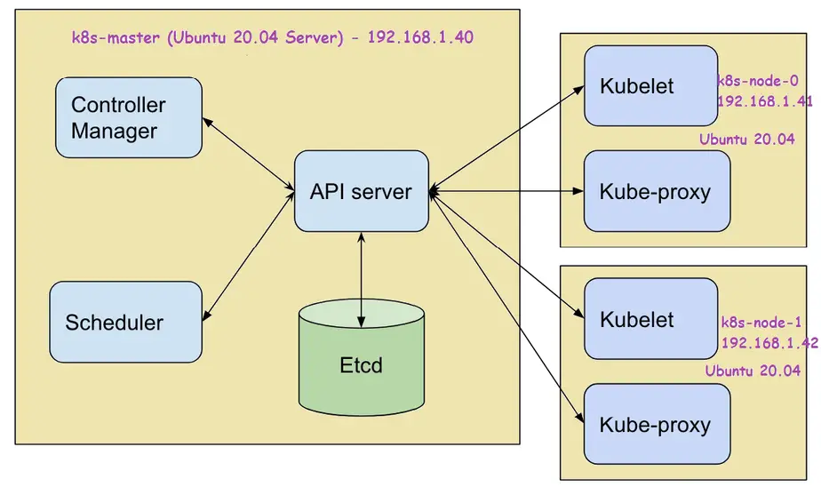
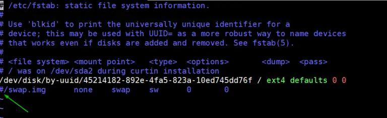
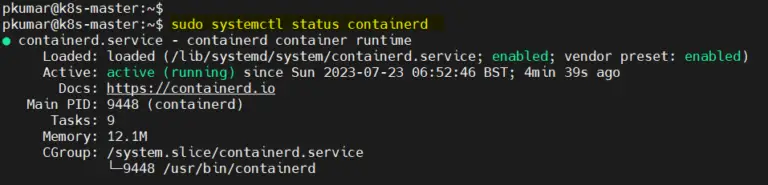
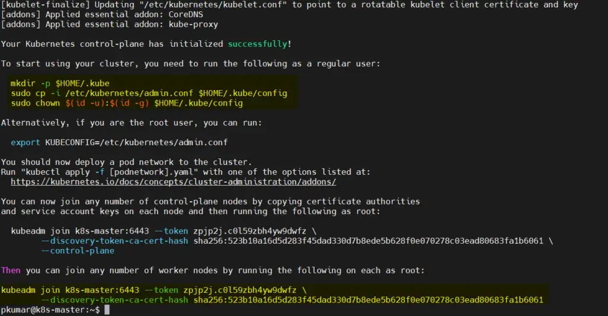
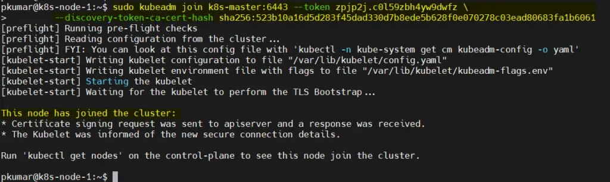
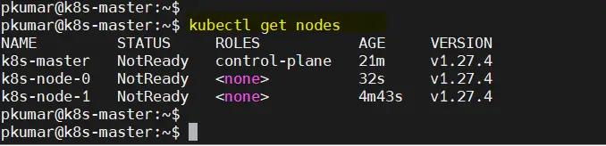
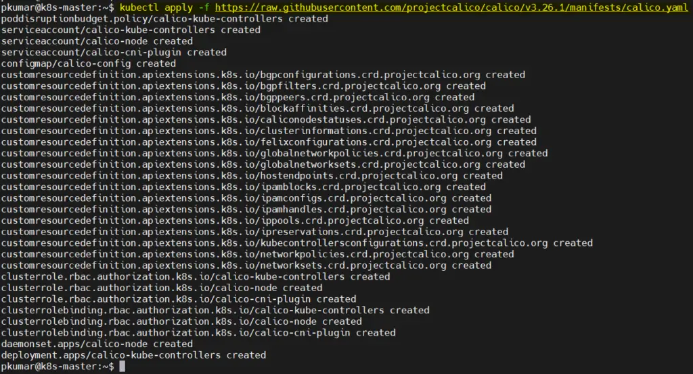
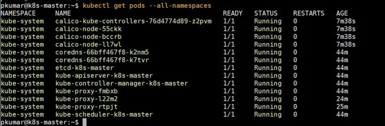
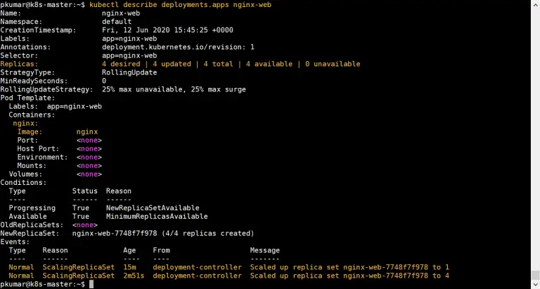
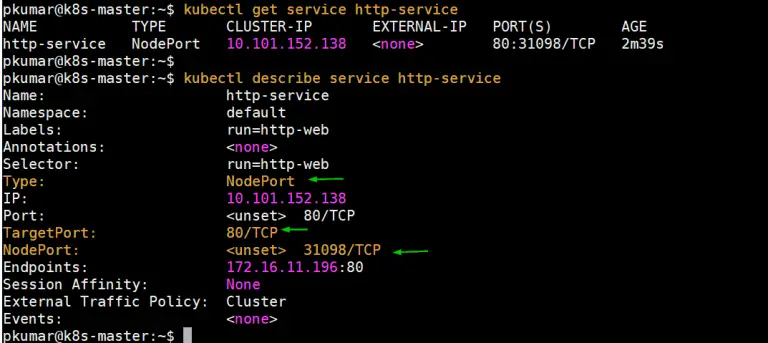

# How to Install Kubernetes Cluster on Ubuntu 20.04

In this post, we will cover how to install Kubernetes cluster on Ubuntu 20.04 step-by-step. By the end of this post, you will have a functional Kubernetes environment that can run and manage your containerized applications seamlessly.

Kubernetes, often abbreviated as K8s, is a powerful container orchestration tool that automates the deployment, scaling, and management of containerized applications. With its widespread adoption, Kubernetes has become an essential tool for modern DevOps teams and developers.

## Prerequisites
Before diving into the installation process, ensure that you have the following prerequisites:
* Ubuntu 20.04 : Make sure you have a clean, up-to-date installation of Ubuntu 20.04 on all the machines you intend to include in your cluster.
* Minimum Resources: Each machine should have at least 2 CPU cores, 2GB of RAM, and enough disk space to accommodate the Kubernetes components.
* Static IP Addresses: Assign static IP address to each node in the cluster to ensure stability and consistency.
* SSH Access: Ensure you have SSH access to all the nodes from the machine you will be using to install the cluster.
* Privileged user with sudo rights
* Stable Internet Connection

## Lab setup:
* Machine 1 – K8s-master – 192.168.1.50
* Machine 2 – K8s-node-0 – 192.168.1.55
* Machine 3 – K8s-node-1 – 192.168.1.60



## 1) Set hostname of Each Node
* Use hostnamectl command to set hostname on each node, example is shown below:
```bash
# Run this command on master node
$ sudo hostnamectl set-hostname "k8s-master"     
# Run this command on node-0
$ sudo hostnamectl set-hostname "k8s-node-0"     
# Run this command on node-1
$ sudo hostnamectl set-hostname "k8s-node-1"     
```

*Add the following entries in /etc/hosts files on each node

VM / PC      |   Hostname
-------------|------
192.168.1.50 |   k8s-master
192.168.1.55 |   k8s-node-0
192.168.1.60 |   k8s-node-1

VM / PC      |   Hostname
-------------|------
192.168.1.50 |   master-node
192.168.1.55 |   worker1-node
192.168.1.60 |   worker2-node

## 2) Disable swap and Add Kernel Modules
Disable swap and add following kernel module on all the nodes ( master + worker nodes).

To disable swap, edit /etc/fstab file and comment out the line which includes entry either swap partition or swap file.
```bash
sudo vi /etc/fstab
```

Save & exit the file

Run swapoff command to disable the swap on the fly

```bash
sudo swapoff -a
```

## Next, add kernel modules and enable IP forwarding
```bash
sudo tee /etc/modules-load.d/containerd.conf <<EOF
overlay
br_netfilter
EOF

sudo modprobe overlay

sudo modprobe br_netfilter

sudo tee /etc/sysctl.d/kubernetes.conf<<EOF
net.bridge.bridge-nf-call-ip6tables = 1
net.bridge.bridge-nf-call-iptables = 1
net.ipv4.ip_forward = 1
EOF

sudo sysctl --system
```

## 3) Install Containerd Runtime on All Nodes
* Install containerd runtime on all the nodes, run following set of commands.
* Run Following apt command to install required dependencies for continaerd
```bash
sudo apt install -y curl gnupg2 software-properties-common apt-transport-https ca-certificates
```
*  Next, add docker repository
```bash
sudo curl -fsSL https://download.docker.com/linux/ubuntu/gpg | sudo gpg --dearmour -o /etc/apt/trusted.gpg.d/docker.gpg

sudo add-apt-repository "deb [arch=amd64] https://download.docker.com/linux/ubuntu $(lsb_release -cs) stable"
```
* After adding repo, install containerd using beneath commands
```bash
sudo apt update

sudo apt install -y containerd.io
```
* Configure the contianerd using following command
```bash
containerd config default | sudo tee /etc/containerd/config.toml >/dev/null 2>&1

sudo sed -i 's/SystemdCgroup \= false/SystemdCgroup \= true/g' /etc/containerd/config.toml
```
* Start and enable containerd service
```bash
sudo sed -i 's/SystemdCgroup \= false/SystemdCgroup \= true/g' /etc/containerd/config.toml
```
* Verify containerd service, run
```bash
sudo systemctl status containerd
```


## 4) Install Kubectl, kubelet and kubeadm on all nodes
* Execute beneath commands on all 3 nodes to add Kubernetes repository and then install kubectl , kubelet and kubeadm utility
```bash
sudo apt install -y apt-transport-https curl 

curl -s https://packages.cloud.google.com/apt/doc/apt-key.gpg | sudo gpg --dearmour -o /etc/apt/trusted.gpg.d/kubernetes-xenial.gpg

sudo apt-add-repository "deb http://apt.kubernetes.io/ kubernetes-xenial main"

sudo apt update && sudo apt install -y kubelet kubeadm kubectl
```
## Note : At time of writing this article, <span style="color: #99ccff;">Ubuntu 16.04 (Xenial Xerus )</span> Kubernetes repository was available but in future, when the kubernetes repository is available for <span style="color: yellow;">Ubuntu 20.04</span> then replace <span style="color: yellow;">xenial</span> with <span style="color: yellow;">focal</span> word in above <span style="color: yellow;">"apt-add-repository"</span> command.

## 5) Install Kubernetes Cluster using kubeadm
# VERY IMPORTANTE
# Login to your master node (k8s-master or master-node) and run below ‘kubeadm init‘ command to initialize Kubernetes cluster:
 ```bash
 
 sudo kubeadm init --control-plane-endpoint=master-node #(192.168.1.50)
 
 # Your Node Machine 
 # sudo kubeadm init --control-plane-endpoint=k8s-master
```
* Once the cluster is initialized successfully, we will get the following output



## After the initialization process completes, you’ll see a message containing a ‘kubeadm join’ command. Save this command; we’ll use it later to add worker nodes to the cluster.

In order to interact with cluster as a regular user, let’s execute the following commands, these commands are already there in output just copy paste them.

```bash
  mkdir -p $HOME/.kube

  sudo cp -i /etc/kubernetes/admin.conf $HOME/.kube/config

  sudo chown $(id -u):$(id -g) $HOME/.kube/config
```
## 6) Add Worker Nodes to Kubernetes Cluster
* If you want to add worker nodes to your Kubernetes cluster, log in to each worker node and run the ‘kubeadm join’ command you saved from Step 5.

* Copy <span style="color: #99ccff;">*"kubeadm join"*</span> command and paste it on both nodes (worker nodes).
```bash
sudo kubeadm join k8s-master:6443 --token zpjp2j.c0l59zbh4yw9dwfz \
--discovery-token-ca-cert-hash sha256:523b10a16d5d283f45dad330d7b8ede5b628f0e070278c03ead80683fa1b6061
```


* Now, verify the nodes status from the master node,  run <span style="color: #99ccff;">*"kubectl get nodes"*</span>
```bash
 kubectl get nodes
```


## As we can see both worker nodes and master node have joined the cluster, but status of each node is <span style="color: #99ccff;">*"NotReady"*</span>. To make the status <span style="color: #99ccff;">*"Ready"*</span> we must deploy Container Network Interface (CNI) based Pod network add-ons like calico, kube-router and weave-net. As the name suggests, pod network add-ons allow pods to communicate each other.

## 7) Deploy Calico Pod Network Add-on
* From the master node, run the following command to install Calico pod network add-on,
```bash
kubectl apply -f https://raw.githubusercontent.com/projectcalico/calico/v3.26.1/manifests/calico.yaml
```

* Once it has been deployed successfully then nodes status will become ready, let’s re-run kubectl command to verify nodes status
```bash
$ kubectl get nodes
NAME         STATUS   ROLES    AGE   VERSION
k8s-master   Ready    master   39m   v1.27.4
k8s-node-0   Ready    <none>   19m   v1.27.4
k8s-node-1   Ready    <none>   19m   v1.27.4
```
*  Execute below command to verify status of pods from all namespaces



* Perfect, above confirms that all the pods are running and are in healthy state. Let’s try to deploy pods, service and deployments to see whether our Kubernetes cluster is working fine or not.

## Note: To enable bash completion feature on your master node, execute the followings
```bash
$ echo 'source <(kubectl completion bash)' >>~/.bashrc
$ source ~/.bashrc

```
<span style="color: yellow;">Read Also :</span> [How to Setup Kubernetes Cluster on Google Cloud Platform (GCP)](https://www.linuxtechi.com/setup-kubernetes-cluster-google-cloud-platform-gcp/)

## 8) Test and Verify Kubernetes Cluster Installation
* Let’s create a deployment named <span style="color: yellow;">nginx-web</span> with nginx container image in the default namespace, run the following kubectl command from the master node:
```bash
$ kubectl create deployment nginx-web --image=nginx

deployment.apps/nginx-web created
$
```
* Run below command to verify the status of deployment
```bash
$ kubectl get deployments.apps
NAME        READY   UP-TO-DATE   AVAILABLE   AGE
nginx-web   1/1     1            1           41s

$ kubectl get deployments.apps  -o wide
NAME        READY   UP-TO-DATE   AVAILABLE   AGE   CONTAINERS   IMAGES   SELECTOR
nginx-web   1/1     1            1           56s   nginx        nginx    app=nginx-web

$ kubectl get  pods
NAME                         READY   STATUS    RESTARTS   AGE
nginx-web-7748f7f978-nk8b2   1/1     Running   0          2m50s

```
* As we can see that deployment has been created successfully with default replica.
### Let’s scale up the deployment, set replicas as 4. Run the following command:

```bash
$ kubectl scale --replicas=4 deployment nginx-web

deployment.apps/nginx-web scaled
```
* Now verify status of your deployment using following commands:
```bash
$ kubectl get deployments.apps nginx-web

NAME        READY   UP-TO-DATE   AVAILABLE   AGE
nginx-web   4/4     4            4           13m

$ kubectl describe deployments.apps nginx-web
```


* Above confirms that nginx based deployment has been scale up successfully.

### Let’s perform one more test, create a pod named <span style="color: yellow;">*"http-web"*</span> and expose it via service named <span style="color: yellow;">*"http-service"*</span> with port 80 and <span style="color: yellow;">**NodePort**</span> as a type.

* Run the following command to create a pod:
```bash
$ kubectl run http-web --image=httpd --port=80

pod/http-web created
```
* Create a service using beneath command and expose above created pod on port 80:
```bash
$ kubectl expose pod http-web --name=http-service --port=80 --type=NodePort

service/http-service exposed

$ kubectl get service http-service

NAME           TYPE       CLUSTER-IP       EXTERNAL-IP   PORT(S)        AGE
http-service   NodePort   10.101.152.138   <none>        80:31098/TCP   10s
```



* Get the Node IP or hostname on which http-web pod is deployed and then access webserver via NodePort (31098)
```bash
$ kubectl get pods http-web -o wide
NAME       READY   STATUS    RESTARTS   AGE   IP              NODE         NOMINATED NODE   READINESS GATES
http-web   1/1     Running   0          59m   172.16.11.196   k8s-node-0   <none>           <none>

$ curl http://k8s-node-0:31098
<html><body><h1>It works!</h1></body></html>
```

## Docker on Ubuntu 22.04 Step-by-Step With Docker-compose
* Also Read : [How to Install Docker on Ubuntu 22.04 Step-by-Step](https://www.linuxtechi.com/install-use-docker-on-ubuntu/)

* Also Read : [How to Install Kubernetes Cluster on Ubuntu 20.04](https://www.linuxtechi.com/install-kubernetes-k8s-on-ubuntu-20-04/)

* Also Read : [How to Setup NGINX Ingress Controller in Kubernetes](https://www.linuxtechi.com/setup-nginx-ingress-controller-in-kubernetes/)
* Also Read : [How to Setup Private Docker Registry in Kubernetes (k8s)](https://www.linuxtechi.com/setup-private-docker-registry-kubernetes/)
* Also Read : [How to Setup Kubernetes Cluster on Google Cloud Platform (GCP)](https://www.linuxtechi.com/setup-kubernetes-cluster-google-cloud-platform-gcp/)

* Also Read : [How to Install MiniKube on RHEL 8/Rocky Linux 8/AlmaLinux 8](https://www.linuxtechi.com/install-minikube-on-rhel-rockylinux-almalinux/)

* Also Read : [How to Configure NFS based Persistent Volume in Kubernetes](https://www.linuxtechi.com/configure-nfs-persistent-volume-kubernetes/)

* Also Read : [How to Setup Local APT Repository Server on Ubuntu 20.04](https://www.linuxtechi.com/setup-local-apt-repository-server-ubuntu/docker)

* Also Read : [How to Configure Static IP Address on Ubuntu 22.04 LTS](https://www.linuxtechi.com/configure-static-ip-address-ubuntu-22-04-lts/)