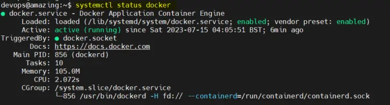
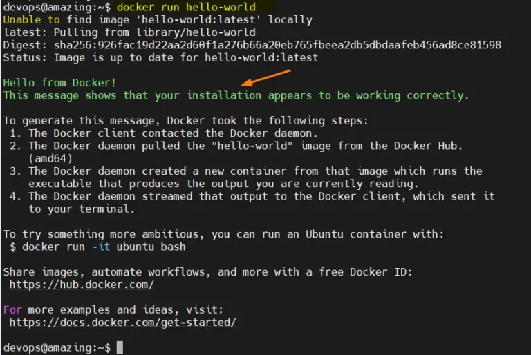
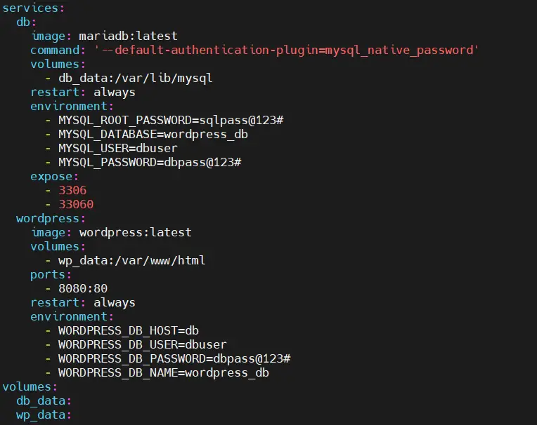

# How to Install Docker on Ubuntu 22.04 Step-by-Step

## 1) Install Docker Dependencies
* Login to your Ubuntu 22.04 system and run the following apt commands to install docker dependencies
```bash
$ sudo apt update

$ sudo apt install ca-certificates curl gnupg -y
```
## 2) Add Docker official APT Repository
* Though the docker packages are available in default package repositories of Ubuntu 22.04 but it is recommended to use docker official repository.So, to enable its repository first add Docker’s official GPG key, run
```bash
$ sudo install -m 0755 -d /etc/apt/keyrings

$ curl -fsSL https://download.docker.com/linux/ubuntu/gpg | sudo gpg --dearmor -o /etc/apt/keyrings/docker.gpg

$ sudo chmod a+r /etc/apt/keyrings/docker.gpg
```
## Next, add the Docker repository to the system’s package sources
```bash
$ echo \
"deb [arch="$(dpkg --print-architecture)" signed-by=/etc/apt/keyrings/docker.gpg] https://download.docker.com/linux/ubuntu \
"$(. /etc/os-release && echo "$VERSION_CODENAME")" stable" | \
sudo tee /etc/apt/sources.list.d/docker.list > /dev/null

```

## 3) Install Docker on Ubuntu 22.04
* Now that the Docker repository is added, update the package index and install Docker
```bash
$ sudo apt update

$ sudo apt install docker-ce docker-ce-cli containerd.io docker-buildx-plugin docker-compose-plugin -y
```
* Once the docker package is installed, add your local user to docker group so that user can run docker commands without sudo
```bash
$ sudo usermod -aG docker $USER

$ newgrp docker
```
* <span style="color: #99ccff;">Note:</span> Make sure logout and login again after adding local user to docker group
* Verify the Docker version:
```bash
$ docker version
```

* Check docker service status, run below systemctl command
```bash
$ sudo systemctl status docker
```

* Above output confirms that docker service is up and running.

## Step 4) Verify and Test Docker Installation
* In order to test and verify docker installation, spin up a ‘hello-world’ container using below docker command.
```bash
$ docker run hello-world
```

* Above docker command will download ‘hello-world’ container image and then will spin up a container. 
* If container displays the informational message, then we can say that our docker installation is successful.  Output of above ‘docker run’ would look like below.



----------------------------------------------------------------

## Docker Compose Installation on Ubuntu 22.04
* To install docker compose on Ubuntu Linux, execute the following commands one after the another
```bash
sudo curl -L "https://github.com/docker/compose/releases/download/v2.20.0/docker-compose-$(uname -s)-$(uname -m)" -o /usr/local/bin/docker-compose

sudo chmod +x /usr/local/bin/docker-compose
```
* Check the docker-compose version by running following command,
```bash
$ docker-compose --version
Docker Compose version v2.20.0
```
* Perfect, above output confirms that docker compose of version 2.20.0 is installed.

## Test Docker Compose Installation
* To test docker compose, let’s try to deploy WordPress using compose file. Create a project directory ‘wordpress’ using mkdir command.
```bash
$ mkdir wordpress ; cd wordpress
```
* Create a docker-compose.yaml file with following content.
```yaml
services:
  db:
    image: mariadb:latest
    command: '--default-authentication-plugin=mysql_native_password'
    volumes:
      - db_data:/var/lib/mysql
    restart: always
    environment:
      - MYSQL_ROOT_PASSWORD=sqlpass@123#
      - MYSQL_DATABASE=wordpress_db
      - MYSQL_USER=dbuser
      - MYSQL_PASSWORD=dbpass@123#
    expose:
      - 3306
      - 33060
  wordpress:
    image: wordpress:latest
    volumes:
      - wp_data:/var/www/html
    ports:
      - 8080:80
    restart: always
    environment:
      - WORDPRESS_DB_HOST=db
      - WORDPRESS_DB_USER=dbuser
      - WORDPRESS_DB_PASSWORD=dbpass@123#
      - WORDPRESS_DB_NAME=wordpress_db
volumes:
db_data:
wp_data:
```
* Save and close the file.


* As we can see, we have used two containers one for WordPress web and other one is for database. We are also creating the persistent volume for DB container and WordPress GUI is exposed on ‘8000’ port.

* To deploy the WordPress, run the below command from your project’s directory
```bash
docker-compose up -d
```
* Output of above command would like below:


* Above confirms that two containers are created successfully. Now try to access WordPress from the Web Browser by typing URL:

[http://<Server-IP-Address>:8080](http://localhost:8080)
![WordPress]images/(Wordpress-installation-via-docker-compose-ubuntu-768x583.webp)

* Great, above confirms that WordPress installation is started via docker-compose. Click on Continue and follow screen instructions to finish the installation.

* To stop the WordPress, run the below command from your project’s directory
```bash
docker-compose down
```

* That’s all from this post. I hope you found it useful and informative, please don’t hesitate to share your queries and feedback in below comments section.