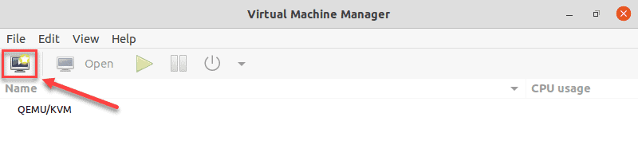
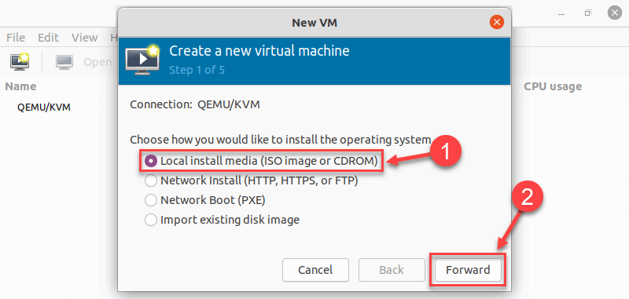
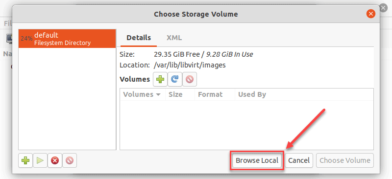
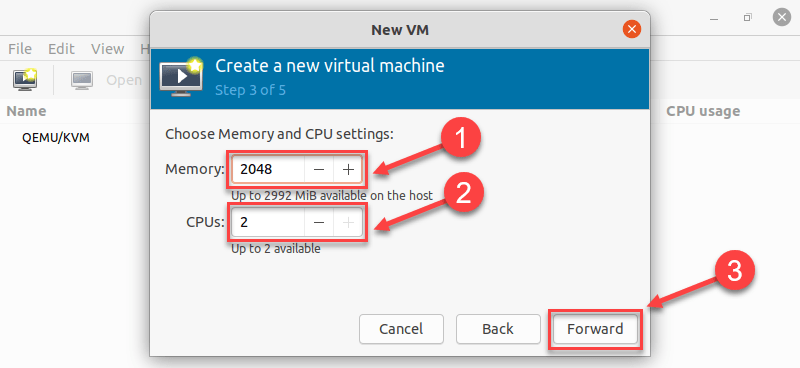
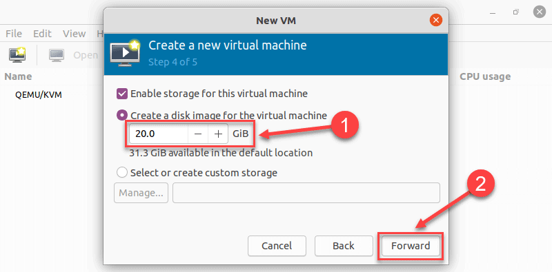
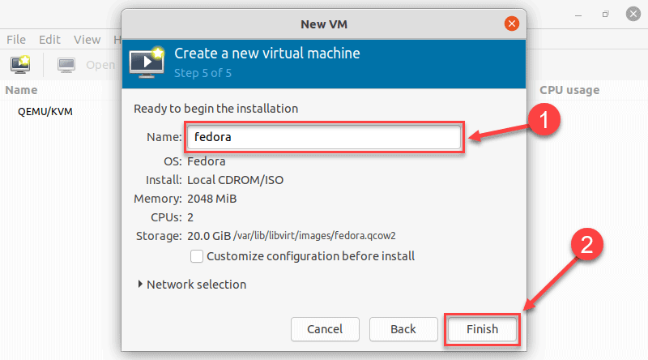
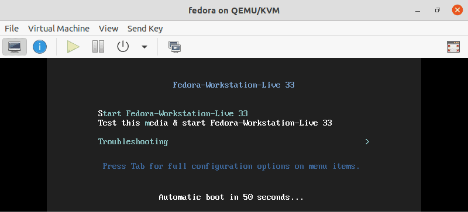
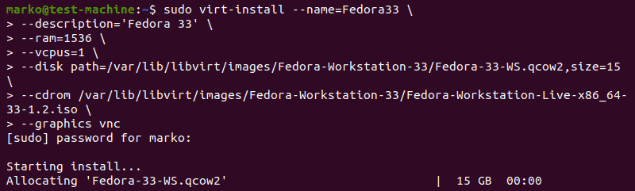

# Install activate KVM and Virtual machines

### Remove SNAP from Ubuntu
### Uninstall SNAP from Ubuntu
```bash
  sudo snap remove chromium snap-store # Remove Packages is Optional
  
  sudo systemctl stop snapd

  sudo apt remove --purge --assume-yes snapd gnome-software-plugin-snap

  sudo rm -rf ~/snap/
  
  sudo rm -rf /var/cache/snapd/ 
  
  su - $USER
```

## Check Virtualization Support on Ubuntu 20.04
```bash
1. Before you begin with installing KVM, check if your CPU supports hardware virtualization via
egrep -c '(vmx|svm)' /proc/cpuinfo
# Expects Any Number
32
# If the command returns a value of 0, your processor is not capable of running KVM

2. Now, check if your system can use KVM acceleration by typing:
sudo kvm-ok
# Expects
INFO: /dev/kvm exists
KVM acceleration can be used

3. To install cpu-checker, run the following command:
# If kvm-ok returns an error stating KVM acceleration cannot be used, try solving the problem by installing cpu-checker
sudo apt install cpu-checker

4. When the installation completes, restart the terminal.
```
# Install KVM on Ubuntu 20.04

## Step 1: Install KVM Packages

* 1. First, update the repositories:
```bash
sudo apt update
```
* 2. Then, install essential KVM packages with the following command:
```bash
sudo apt install qemu-kvm libvirt-daemon-system libvirt-clients bridge-utils
```
## Step 2: Authorize Users
* 1. Only members of the libvirt and kvm user groups can run virtual machines. Add a user to the libvirt group by typing:
```bash
sudo adduser $USER libvirt # Add user to the libvirt group

 # sudo aduser 'omartini' libvirt
 # Checking Groups and user
  id omartini # shows groups for the user
  groups # All  groups the User belongs to 
  less /etc/group # list all groups
```
* 2. Now do the same for the kvm group:
```bash
sudo adduser $USER kvm # Add user to the kvm group
```
## Step 3: Verify the Installation
* 1. Confirm the installation was successful by using the virsh command:
```bash
virsh list --all
```
* 2. Or use the systemctl command to check the status of libvirtd:
```bash
sudo systemctl status libvirtd
```
* 3. Press Q to quit the status screen.

* 4 . If the virtualization daemon is not active, activate it with the following command:
```bash
sudo systemctl enable --now libvirtd
```
## Creating a Virtual Machine on Ubuntu 20.04
* 1. Before you choose one of the two methods listed below, install virt-manager, a tool for creating and managing VMs:
```bash
sudo apt install virt-manager
```

* Make sure you download an ISO containing the OS you wish to install on a VM and proceed to pick an installation method.
## Method 1: Virt Manager GUI
1. Start virt-manager with:
```bash
sudo virt-manager
```
2. In the first window, click the computer icon in the upper-left corner.


3. In the dialogue box that opens, select the option to install the VM using an ISO image. Then click Forward.


4. In the next dialogue, click Browse Local and navigate to the path where you stored the ISO you wish to install.


5. The ISO you chose in the previous window populates the field in Step 2. Proceed to Step 3 by clicking Forward.

6. Enter the amount of RAM and the number of CPUs you wish to allocate to the VM and proceed to the next step.

7. Allocate hard disk space to the VM. Click Forward to go to the last step.

8. Specify the name for your VM and click Finish to complete the setup.

9. The VM starts automatically, prompting you to start installing the OS that’s on the ISO file.


## Method 2: Using Command Line
* Use the virt-install command to create a VM via Linux terminal. The syntax is:
```bash
  virt-install --option1=value --option2=value ...
```
* In the following example, virt-install is used to install Fedora 33 Workstation.
```bash
sudo virt-install --nameFedora33 \
--description='Fedora 33' \
--ram=1536 \
--vcpus=1 \
--disk path=/var/lib/libvirt/images/Fedora-Workstation-33/Fedora-33-WS.qcom2,size=15 \
--cdrom /var/lib/libvirt/images/Fedora-Workstation-33/Fedora-Workstation-Live-x86_64-33-1.2.iso \
--graphics vnc
```


----------------------------------------------------------------
## <span style="color: lightblue;">Tip</span>: For tidier appearance of commands with many options, type a <span style="color: yellow;">back-slash</span> after each option. 
## That way, when you press <span style="color: yellow;">Enter</span>, the command will not execute, and the cursor will go to the next line.
----------------------------------------------------------------
Options behind the command serve to define the parameters of the installation.

Here is what each of them means:
----------------------------------------------------------------
Option         |	Description
---------------|------------------------------------------------
--name	       |The name you give to the VM
--description	 |A short description of the VM
--ram		       |The amount of RAM you wish to allocate to the VM
--vcpus		     |The number of virtual CPUs you wish to allocate to the VM
--disk		     |The location of the VM on your disk (if you specify a qcow2 disk file that does not exist, it will be automatically created)
--cdrom		     |The location of the ISO file you downloaded
--graphics		 |Specifies the display type
----------------------------------------------------------------

Conclusion

After reading this article, you should know how to install KVM on Ubuntu 20.04. Additionally, the article describes two methods of setting up virtual machines, using the virt-manager GUI and the virt-install command.


## Install x11-common Using apt
[How to enable X11 forwarding from Red Hat Enterprise Linux (RHEL), Amazon Linux, SUSE Linux, Ubuntu server to support GUI-based installations from Amazon EC2](https://aws.amazon.com/blogs/compute/how-to-enable-x11-forwarding-from-red-hat-enterprise-linux-rhel-amazon-linux-suse-linux-ubuntu-server-to-support-gui-based-installations-from-amazon-ec2/)
```bash
sudo apt update
```
# Step 1: To install X11 related packages and tools:
```bash
sudo apt install x11-apps
```
# Step 2: configure X11 forwarding
```bash
sudo vi /etc/ssh/sshd_config
X11Forwarding yes
```
# Step 3: To Verify X11Forwarding parameter:
```bash
sudo cat /etc/ssh/sshd_config |grep -i X11Forwarding
```
#  Step 4: To restart ssh service if you changed the value in /etc/ssh/sshd_config:
```bash
sudo service ssh restart
```

## Method 1: Virt Manager GUI
[Virt Manager GUI](https://phoenixnap.com/kb/ubuntu-install-kvm)
```bash
sudo virt-manager
```