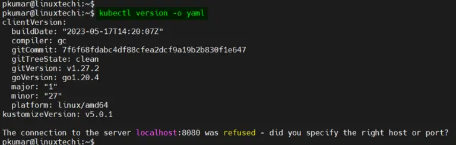
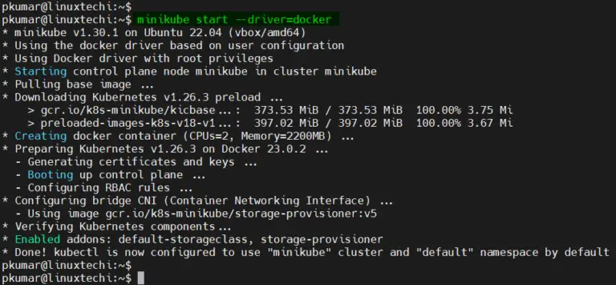
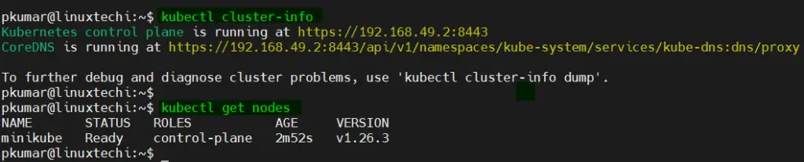
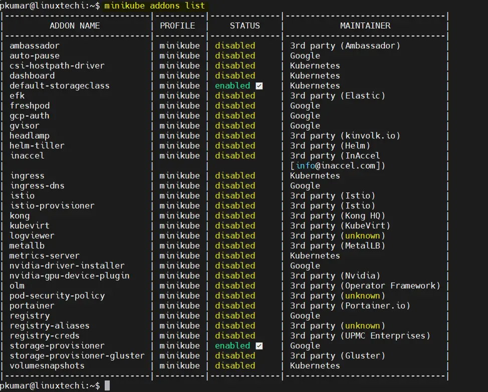
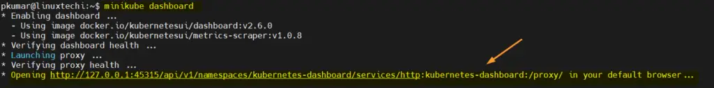
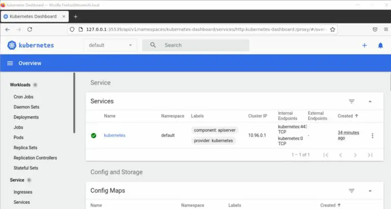
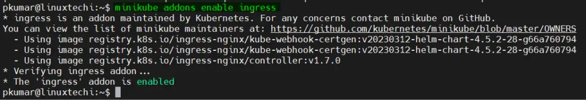
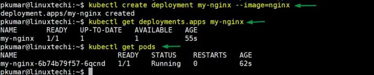
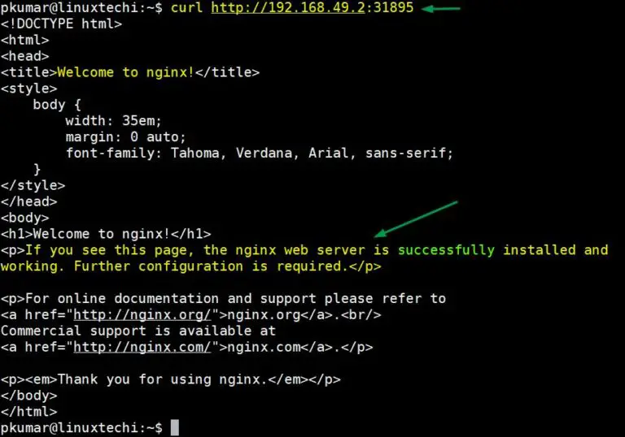

# How to Install Minikube on Ubuntu 22.04 | 20.04
In this article, we will cover how to install of Minikube on Ubuntu 22.04 | 20.04 LTS.

* Minikube is an open-source tool that allows you to run a single-node Kubernetes cluster locally on your machine.

* Minikube is designed to make it easy for developers to set up a Kubernetes environment for local development and testing purposes. 

* It creates a lightweight, isolated Kubernetes cluster that runs inside a virtual machine (VM) on your local system.

## Minikube System Requirements
 * 2 GB RAM or more
 * 2 CPU / vCPU or more
 * 20 GB free hard disk space or more
 * Docker / Virtual Machine Manager – KVM & VirtualBox

 <span style="color: #99ccff;">Note:</span> In this article, we will be using Docker container as a base for minikube. 
 In case, docker is not installed on your Ubuntu system then use following URL to install it.
 [How to Install Docker on Ubuntu 22.04 Step-by-Step](https://www.linuxtechi.com/install-use-docker-on-ubuntu/)

 * Without any further delay, let’s deep dive into the Minikube Installation steps on Ubuntu 22.04 and 20.04 LTS.

 ## Step 1) Apply updates
 * Apply all updates of existing packages of your system by executing the following apt commands
 ```bash
$ sudo apt update -y

$ sudo apt upgrade -y
 ```
 * Once all the updates are installed then reboot your system once.
 ```bash
 sudo reboot
 ```
 ## Step 2) Install Minikube dependencies
 * Install the following minikube dependencies by running beneath command,
 ```bash
 $ sudo apt install -y curl wget apt-transport-https
 ```
 ## Step 3) Download Minikube Binary
 * Use the following curl command to download latest minikube binary,
 ```bash
 $ curl -LO https://storage.googleapis.com/minikube/releases/latest/minikube-linux-amd64
 ```
* Once the binary is downloaded, copy it to the path <span style="color: yellow;">/usr/local/bin</span> and set the executable permissions on it
```bash
$ sudo cp minikube-linux-amd64 /usr/local/bin

$ sudo chmod 777 /usr/local/bin/minikube-linux-amd64
```
* Execute the install
```bash
$ sudo install minikube-linux-amd64 /usr/local/bin/minikube
```
* Verify the minikube version
```bash
$ minikube version
minikube version: v1.30.1
commit: 08896fd1dc362c097c925146c4a0d0dac715ace0
```
* <span style="color: #99ccff;">Note:</span> At the time of writing this tutorial, latest version of minikube was v1.30.1.

## Step 4) Install Kubectl utility
* Kubectl is a command line utility which is used to interact with Kubernetes cluster. It is used for managing deployments, service and pods etc. Use below curl command to download latest version of kubectl.
```bash
$ curl -LO https://storage.googleapis.com/kubernetes-release/release/`curl -s https://storage.googleapis.com/kubernetes-release/release/stable.txt`/bin/linux/amd64/kubectl
```
* Once kubectl is downloaded then set the executable permissions on kubectl binary and move it to the path <span style="color: yellow;">/usr/local/bin</span>.

```bash
$ chmod +x kubectl
$ sudo mv kubectl /usr/local/bin/
```
* Now verify the kubectl version
```bash
$ kubectl version -o yaml
```


## Step 5) Start minikube
* As we are already stated in the beginning that we would be using docker as base for minikue, so start the minikube with the docker driver, run
```bash
$ minikube start --driver=docker
```
* In case you want to start minikube with customize resources and want installer to automatically select the driver then you can run following command:
```bash
$ minikube start --addons=ingress --cpus=2 --cni=flannel --install-addons=true --kubernetes-version=stable --memory=6g
```
* Output would like below

* Perfect, above confirms that minikube cluster has been configured and started successfully.
* Run below minikube command to check status
```bash

$ minikube status
minikube
type: Control Plane
host: Running
kubelet: Running
apiserver: Running
kubeconfig: Configured
pkumar@linuxtechi:~$
```
* Run following kubectl command to verify the Kubernetes version, node status and cluster info.
```bash
$ kubectl cluster-info

$ kubectl get nodes
```
* Output of above commands would like below:


## Step 6) Managing Addons on minikube
* By default, only couple of addons are enabled during minikube installation, to see the addons of minikube, run the below command.
```bash
$ minikube addons list
```


* If you wish to enable any addons run the below minikube command
```bash
$ minikube addons enable <addon-name>
```
* Let’s assume we want to enable and access kubernetes dashboard , run
```bash
$ minikube dashboard
```
* It will open the Kubernetes dashboard in the web browser.


* To enable Ingress controller addon, run
```bash
$ minikube addons enable ingress
```


## Step 7) Verify Minikube Installation
* To verify the minikube installation, let’s try to deploy nginx based deployment
* Run below kubectl command to install nginx based deployment.
```bash
$ kubectl create deployment my-nginx --image=nginx
```
* Run following kubectl command to verify deployment status
```bash
$ kubectl get deployments.apps my-nginx

$ kubectl get pods
```
* Output of above commands would look like below:

* Expose the deployment using following command
```bash
$ kubectl expose deployment my-nginx --name=my-nginx-svc --type=NodePort --port=80

$ kubectl get svc my-nginx-svc
```
* Use below command to get your service url
```bash
$ minikube service my-nginx-svc --url

http://192.168.49.2:31872
```
* Now try to access your nginx based deployment using above url
```bash
$ curl http://192.168.49.2:31872
```
* Output


* Great, above confirms that NGINX application is accessible.

## Step 8) Managing Minikube Cluster
* To stop the minikube, run
```bash
$ minikube stop
```
* To delete the minikube, run
```bash
$ minikube delete
```
* To Start the minikube, run
```bash
$ minikube start
```
* In case you want to start the minikube with higher resource like 8 GB RM and 4 CPU then execute following commands one after the another.

```bash
$ minikube config set cpus 4
$ minikube config set memory 8192
$ minikube delete
$ minikube start
```

* That’s all from this tutorial, I hope you have learned how to install Minikube on Ubuntu 22.04 & 22.04. Please don’t hesitate to share your feedback and comments.