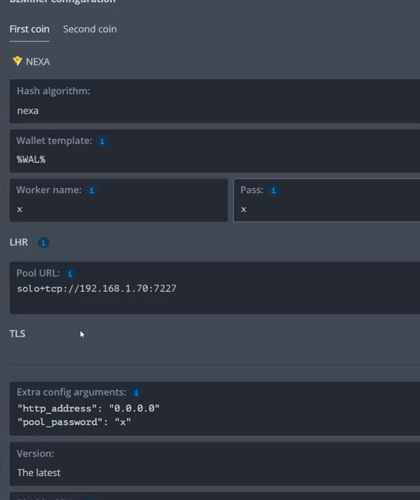
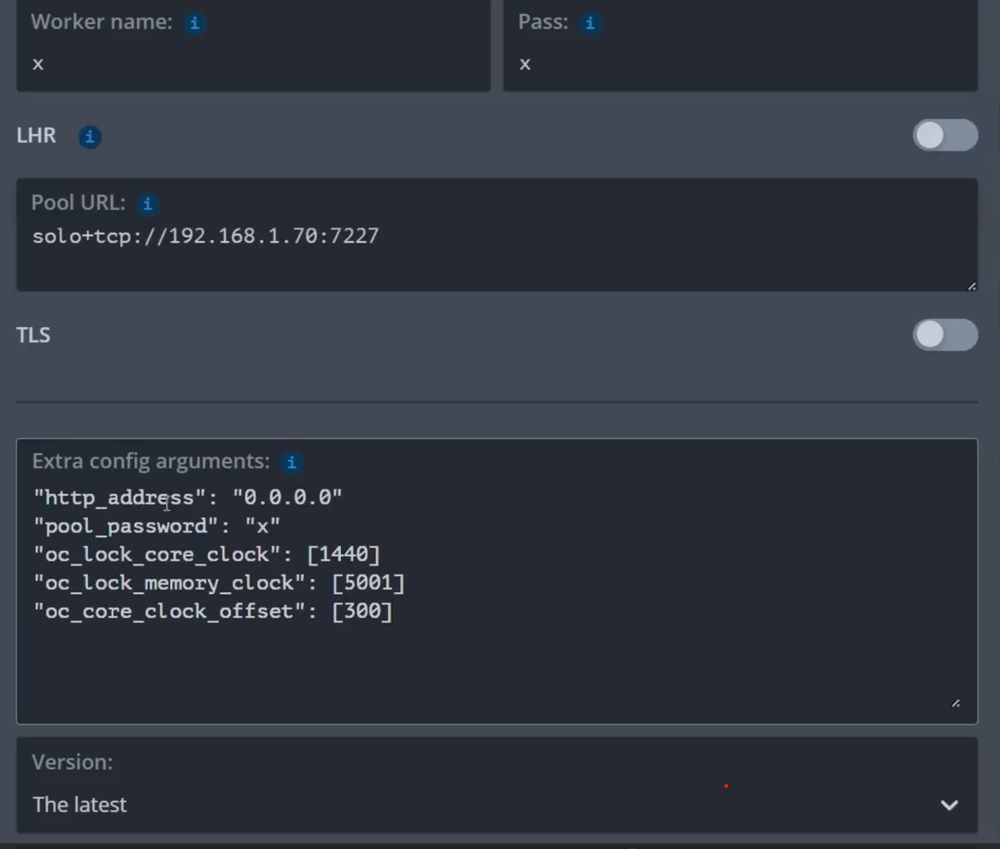

# Run Sync Node

## Run and Wait to 100% Sync and Download all Blockchain
Sync Blockchain Could take hours days, weekks , depend in my Machine and Internect Connection
```bash
./nexa-qt -server -printconsole

./nexad -server -printconsole

# Windows
nexad.exe -server -printconsole
```

# Setup Config Nexa Node IPS Solo Local Mining

## Mining Mode
### Allow Firewall 7228/tcp  an 20001/tcp 
```bash
./nexa-qt -server=1 -rpcallowip=0.0.0.0/0 -printconsole=1 -rpcuser=x -rpcpassword=x

./nexad -server=1 -rpcallowip=0.0.0.0/0 -printconsole=1 -rpcuser=x -rpcpassword=x

# Windows
nexad.exe -server=1 -rpcallowip=0.0.0.0/0 -printconsole=1 -rpcuser=x -rpcpassword=x

nexa-qt.exe -server=1 -rpcallowip=0.0.0.0/0 -printconsole=1 -rpcuser=x -rpcpassword=x
```
## IP Address SOLO+TCP Mining:
```bash
 # ON Hive OS or cmd miner pool:
 solo+tcp://192.168.1.50:7227   (NIPOGi-PC)
```


```bash
 # Extra Configs
"http_address": "0.0.0.0"
"pool_password": "x"
"oc_lock_core_clock": [1440, 1440, 0]
"oc_lock_memory_clock": [5001, 5001, 3500]
"oc_core_clock_offset": [300, 300, 0]
```

# Browser BZMiner

## Go to the IP your RIG is on and connect tyo the port :4014
[BzMiner Local](https://192.168.1.50:4014/)

## Extra Config Arguments:



## Windows or Linux CMD line
```bash
bzminer.exe -a nexa -w nexa:nqtsq5g5jysdg4h8xxyqk449r2h7mr4v7dme6a4ygefy7sat -p solo+tcp://192.168.1.50:7227 --nc 1 --http_address 0.0.0.0 -r x --pool_password x

./bzminer -a nexa -w nexa:nqtsq5g5jysdg4h8xxyqk449r2h7mr4v7dme6a4ygefy7sat -p solo+tcp://192.168.1.50:7227 --nc 1 --http_address 0.0.0.0 -r x --pool_password x

```


# MISC Firewall

## Firewal-Cmd 
```bash
 sudo apt update && sudo apt upgrade -y
 
 sudo apt install firewalld -y
 sudo systemctl start firewalld
 sudo systemctl enable firewalld

 # NODE NEXA LOCAL
 sudo firewall-cmd --add-port=7227/tcp --permanent
 sudo firewall-cmd --add-port=7227/udp --permanent
 
 sudo firewall-cmd --add-port=7228/tcp --permanent
 sudo firewall-cmd --add-port=7228/udp --permanent
 sudo firewall-cmd --add-port=20001/tcp --permanent
 sudo firewall-cmd --add-port=20001/udp --permanent
 sudo firewall-cmd --reload
```
## UFW Firewall
```bash
 sudo apt update && sudo apt upgrade -y
 
 sudo apt install ufw -y
 sudo ufw allow proto tcp from any to any port 22

 sudo ufw allow ssh
 sudo ufw status
 
 # NODE NEXA LOCAL
 sudo ufw allow 7227/tcp
 sudo ufw allow 7227/udp
 
 sudo ufw allow 7228/tcp
 sudo ufw allow 7228/udp
 sudo ufw allow 20001/tcp
 sudo ufw allow 20001/udp
 sudo ufw reload
`````
