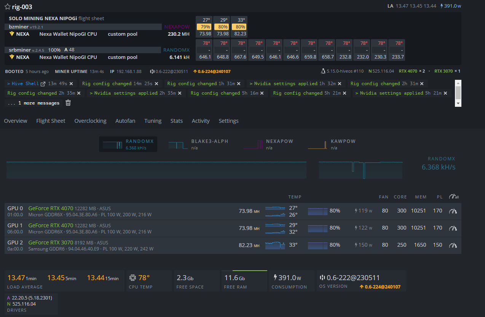
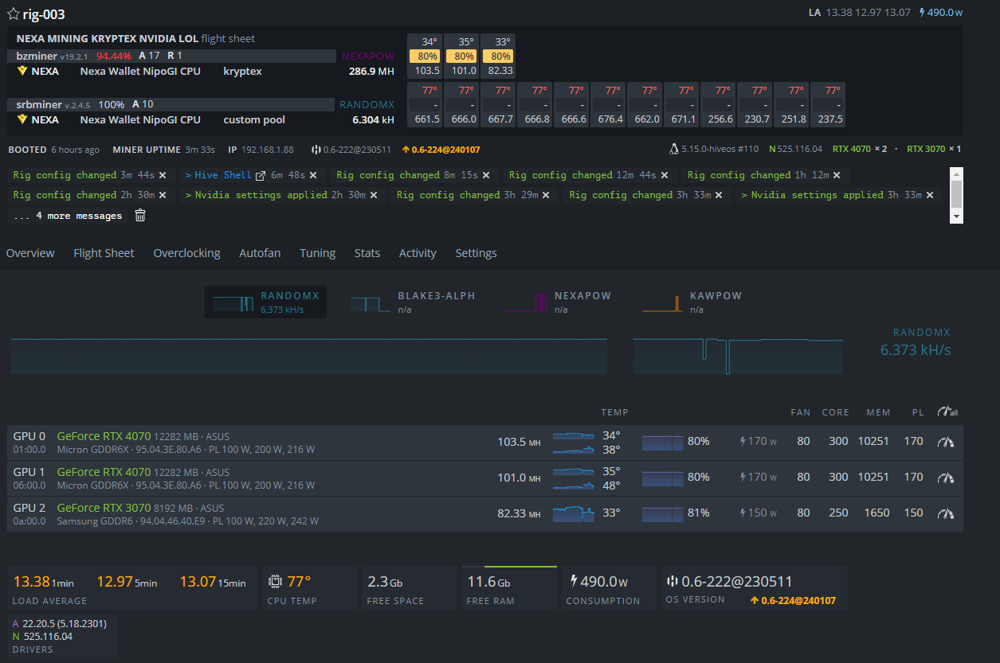
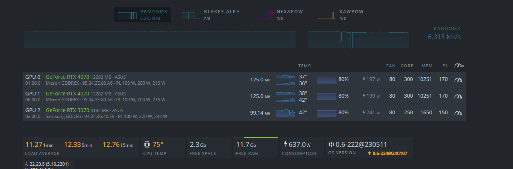
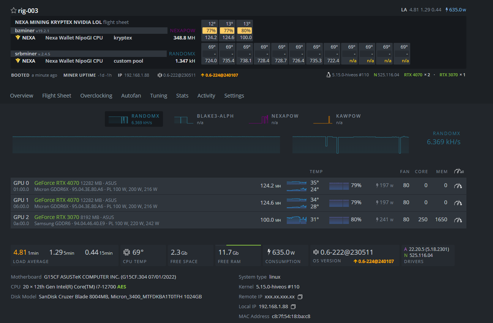
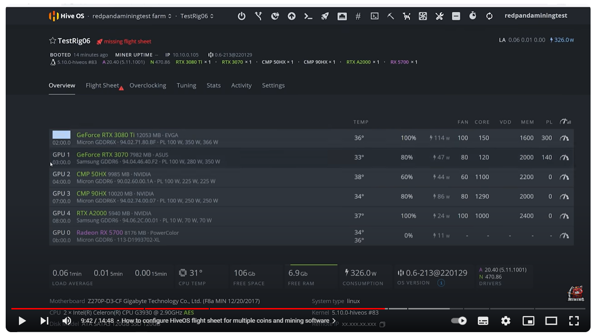

# RTX 4070 RTX 3070 Over Clocking

```bash
 # Extra Configs
"http_address": "0.0.0.0"
"pool_password": "x"
"oc_lock_core_clock": [1440, 1440, 0]
"oc_lock_memory_clock": [5001, 5001, 3500]
"oc_core_clock_offset": [300, 300, 0]
```

## Others
## Made on 22/01/2025



# RTX 4070 (22/01/2024)
```bash
 # Extra Configs
"oc_lock_core_clock": [0, 0, 0]
"oc_lock_memory_clock": [10521, 10521, 3500]
"oc_core_clock_offset": [300, 300, 0]
```



## From Kryptex Page
## RTX 4070 Ti

[RTX 4070 Ti](https://www.kryptex.com/en/overclocking/nvidia-rtx-4070-ti-micron-efficiency-overclock)
```bash
Extra information
Memory: Micron

Overclock settings

Core clock offset: 300
Core clock lock: 2205
Memory clock lock: 5001
Powerlimit: 300

Miner options for lolMiner:
--coff 300 --cclk 2205 --mclk 5001 --pl 300

Miner options for Rigel:
--cclock 300 --lock-cclock 2205 --lock-mclock 5001 --pl 300

Miner options for BzMiner:
--oc_core_clock_offset 300 --oc_lock_core_clock 2205 --oc_lock_memory_clock 5001 --oc_power_limit 300

Hashrate 138.19 Mh/s
Efficiency 0.82 Mh/W
Power Reported: 169 watt
```
## RTX 4070
[RTX 4070](https://www.kryptex.com/en/overclocking/gigabyte-rtx-4070-windforce)
```bash
MSI Afterburner
Hashrate / Algorithm
0.0 MH/s  ⚡️ 122.0 MH/s (+122.0)
NexaPoW NEXA
Core / Memory / Power
2415  10251     100%

Extra information
* Windows
* Lol miner 1.76
* MSA afterburner (OC curve editor)
* Video driver: 537.58
* 910mV 2415MHz 10251MHz
* 122Mh/s 191W 🌡️71°C GPU 🌡️76°C MEM 🌡️86°C HOT SPOT 🌪️60-62% Fan
* 🌡️25°C Home

 # Extra Configs
"oc_lock_core_clock": [2451, 2451, 0]
"oc_lock_memory_clock": [10521, 10521, 3500]
"oc_core_clock_offset": [300, 300, 0]
"oc_power_limit": [10521, 10521, 300]  # ERRADO

# OR
# Extra Configs
"oc_lock_core_clock": [2451, 2451, 250]
"oc_lock_memory_clock": [10521, 10521, 1650]
"oc_core_clock_offset": [300, 300, 250]
"oc_power_limit": [200, 200, 300]
```

## RTX 3070 With BZMiner
```bash
 # Extra Configs
"oc_lock_core_clock": [2451, 2451, 0]
"oc_lock_memory_clock": [10521, 10521, 3500]
"oc_core_clock_offset": [300, 300, 0]
"oc_power_limit": [200, 200, 150]

 [  99.14Mhz   ]
"oc_lock_core_clock": [2451, 2451, 0]
"oc_lock_memory_clock": [10521, 10521, 1650]
"oc_core_clock_offset": [300, 300, 0]
"oc_power_limit": [200, 200, 245]

RTX 3070  [  ~ 88.00Mhz   ]  23/01/2024
RTX 4070  [  ~ 125.00Mhz  ]  23/01/2024
"oc_lock_core_clock": [0, 2451, 2451, 2451, 2451, 2451]
"oc_lock_memory_clock": [1650, 10521, 10521, 10521, 10521, 10521]
"oc_core_clock_offset": [0, 300, 300, 300, 300, 300]
"oc_power_limit": [180, 210, 210, 210, 210, 210]
```
## AND Did also On OC of the Hive OS



# Some Generic Configs



